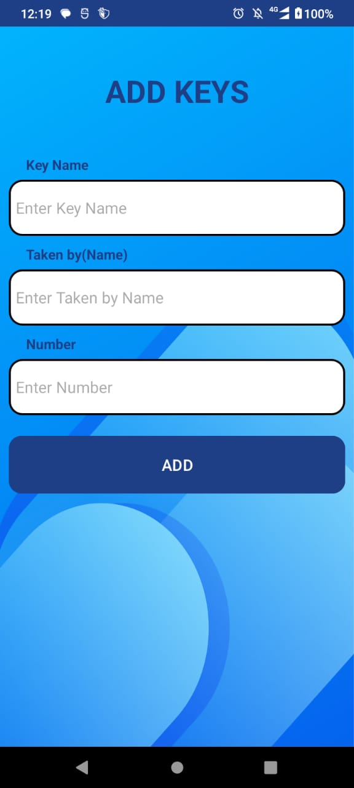
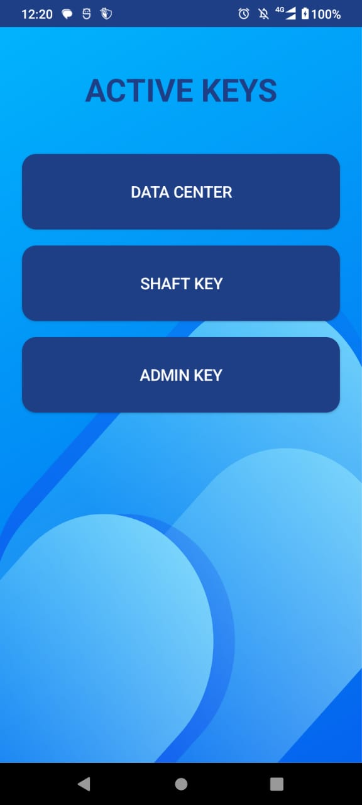
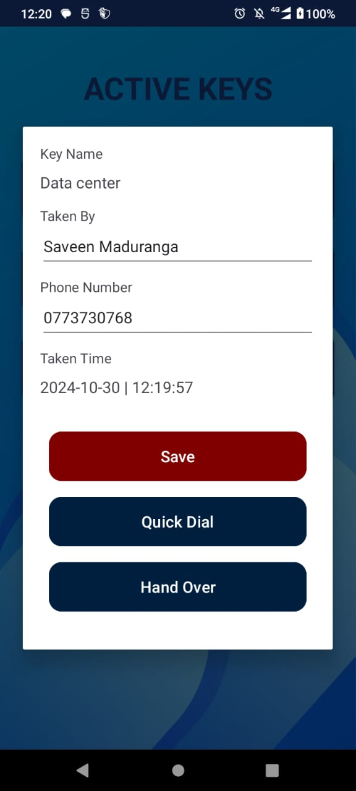
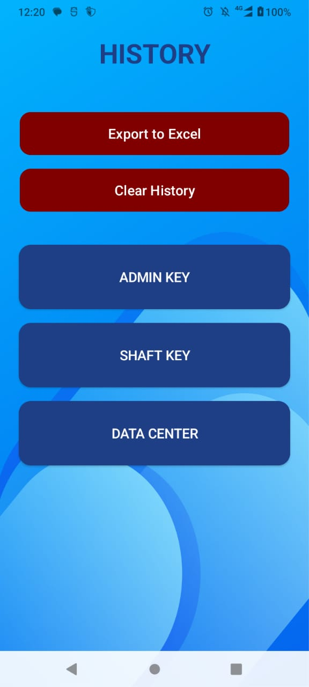

## Key Management System ( Kotlin + SQLite )

## Screenshots

<table>
  <tr>
    <td></td>
    <td></td>
    <td></td>
    <td></td>
    <td></td>
    <td></td>
  </tr>
  <tr>
    
  </tr>
</table>
